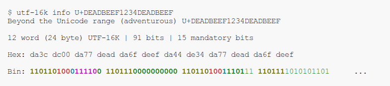

# UTF-16K

Unlimited UTF-16! UTF-16 ⊆ UTF-16K.

- UTF-16K is a way to expand UTF-16 indefinitely without breaking UTF-16's existing syntax.
- This repository contains a Python implementation of UTF-16K.
- See [UTF-8000-Website](https://github.com/UTF-8000/UTF-8000-Website) for the full writeup of UTF-8K and UTF-16K.
- UTF-16K is in no way endorsed by or representative of the [Unicode Consortium](https://home.unicode.org/). This is a standalone project.

## Installing

Available on PyPI as [UTF-16K](https://pypi.org/project/UTF-16K/)

Recommended install using [pipx](https://github.com/pypa/pipx):

```
$ pipx install UTF-16K
```

provides

```
utf-16k(1)
```

with subcommands

```
utf-16k info
utf-16k encode
utf-16k decode
```

## TLDR Examples

### Using `utf-16k info`



### Color key:

- Bright Yellow: UTF-16 surrogate frame `110110` (high) or `110111` (low)
- Bright Red: upper 4 or 3 content bits of high surrogates, for UTF-16 the Unicode Plane indicator bits, for UTF-16K the bits '100' that indicate Planes 9 and 10
- Bright Cyan: UTF-16K self-synchronization bit `0` or `1`
- Bright Magenta: UTF-16K self-punctuation bits `111...110`
- Bright Green: mandatory content bits (nb 4-word UTF-16K works slightly differently)
- Green: content bits

### Using `utf-16k encode`

```
$ echo 'U+DEADBEEFBADF00D' | utf-16k encode | hexdump -C
00000000  da 33 dd ea da 76 df ee  da 7e df ad da 7c dc 0d  |.3...v...~...|..|
00000010
```

### Using `utf-16k decode`

Using the bytes from the encode example above

```
$ echo -ne '\xda\x33\xdd\xea\xda\x76\xdf\xee\xda\x7e\xdf\xad\xda\x7c\xdc\x0d' | utf-16k decode
U+DEADBEEFBADF00D |              | da33 ddea da76 dfee da7e dfad da7c dc0d | 1101101000110011 1101110111101010 ...
```

## Package Contents

- encode.py
  - `encode(x: int) -> tuple[int]`: Encode an unsigned integer in UTF-16K and return the words.
- decode.py
  - `UTF16KIncrementalDecoder`: A 'fancy' incremental decoder class that can be fed words, and can be iterated over, yielding `UTF16KInt`s when full code units have been supplied and decoded.
- UTF16KInt.py
  - A wrapper around `UTF16KWord`s that form a code unit.
- UTF16KWord.py
  - `UTF16KWord`: a 'fancy' wrapper around UTF-16K words that is useful for education and inspection.
  - Various constants and utility functions.

## See Also

- [UTF-8K](https://github.com/UTF-8000/UTF-8000-Python)
- [UTF-8000-Website](https://github.com/UTF-8000/UTF-8000-Website), the main UTF-8000 specification for UTF-8K and UTF-16K, hosted at [utf-8000.jb2170.com](https://utf-8000.jb2170.com/)
